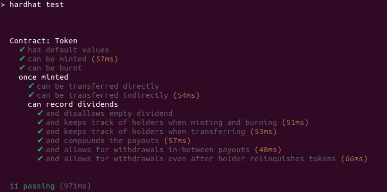

# Tech interview smart contracts coding problem

This is a Solidity coding problem for tech interviews. It is designed to take **no more than a few hours**.

## Getting setup

Ensure you have installed:

- [Node.js](https://nodejs.org/) **v20+**
- [Hardhat](https://hardhat.org/) (already included as a dev dependency)

## Instructions

### 1. Setup

Clone the repo locally and install the NPM dependencies using npm:

### 2. Task

**You only need to write code in the `Token.sol` file. Please ensure all the unit tests pass to successfully complete this part.**

The contracts consist of a mintable ERC-20 `Token` (which is similar to a _Wrapped ETH_ token). Callers mint tokens by depositing ETH. They can then burn their token balance to get the equivalent amount of deposited ETH back.

In addition, token holders can receive dividend payments in ETH in proportion to their token balance relative to the total supply. Dividends are assigned by looping through the list of holders.

Dividend payments are assigned to token holders' addresses. This means that even if a token holder were to send their tokens to somebody else later on or burn their tokens, they would still be entitled to the dividends they accrued whilst they were holding the tokens. 

You will thus need to **efficiently** keep track of individual token holder addresses in order to assign dividend payouts to holders with minimal gas cost.

For a clearer understanding of how the code is supposed to work please refer to the tests in the `test` folder.

Your Solution must pass the test: `npm run test` - run the tests (Hardhat)

### 3: Submission

Record a short [Loom video](https://www.loom.com) showing how it works, including the expected and actual behavior if you're testing.

### 4. Deadline

Please complete and submit the result within 1 ~ 2 hours unless otherwise discussed.

---

## Solution notes

### Approach

Dividends are distributed using an **accumulator (reward-per-share) pattern**, so `recordDividend()` never loops over holders:

- A single running value, `accDividendPerToken`, is scaled by `1e18` and incremented on every `recordDividend()` call: `accDividendPerToken += (msg.value * 1e18) / totalSupply`.
- Each holder stores a `dividendSnapshot` (their last-seen value of the accumulator) and a `storedDividend` (dividend already settled and withdrawable).
- Before **any** balance change (`mint`, `burn`, `transfer`, `transferFrom`), the affected address' pending dividend is settled using their balance *before* the change: `owed = balance * (accDividendPerToken - dividendSnapshot) / 1e18`. This guarantees dividends already accrued are preserved even after a holder sends away or burns their tokens.
- `getWithdrawableDividend` is a pure view combining `storedDividend` with any not-yet-settled amount, computed on the fly — no storage writes needed to check a balance.

### Holder tracking

`getNumTokenHolders` / `getTokenHolder` are backed by a dynamic array of current holders plus a `1-based` index mapping:

- Adding a holder: appended to the array in O(1) the first time their balance becomes non-zero.
- Removing a holder: swap-with-last-and-pop in O(1) when their balance returns to zero (order is not preserved, which the interface doesn't require).

### Verification

In addition to the provided `test/token.test.js` suite, the implementation was independently verified by compiling `Token.sol` with `solc` and exercising it against a local EVM, reproducing the exact multi-step scenarios in the test file (mint/transfer/burn sequences, compounded dividend payouts across changing balances, mid-stream withdrawals, and dividend entitlement surviving a holder relinquishing all their tokens).
